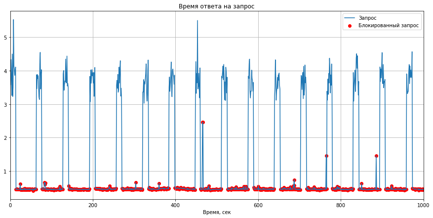
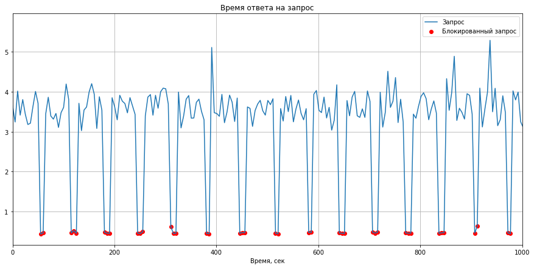

# Тестовое задание для E-COMET 24.07.2024

Задание представляет из себя бэкенд веб-приложения по парсингу и представлению данных по лучшим репозиториям гитхаба.

## Инструкция по запуску

В силу разнородности возможной инфраструктуры, а так-же необходимости запуска парсера посредством Yandex Cloud Functions, процедура запуска разделена в соответствии с тремя структурным компонентами системы:

### База данных
Предполагается, что БД PostgreSQL запущена без применения лишних абстракций в ввиде разного рода виртуализаций, для лучшей производительности.
Необходимо создать базу данных, запомнить ее название, и, далее, заполнить ее согласно схеме файла [db_shema.sql](db_shema.sql).

### Парсеры
Проект содержит два парсера: для репозиториев и для коммитов. Разворачиваются они на Yandex Cloud Functions. Необходим сервисный аккаунт, от имени которого будет вызываться функция с ролью `functions.functionInvoker`.

Для деплоя на облако Яндекса, выполните следующие команды:
```
    cd ./parser/repos
    zip -r repo_parser.zip .
    yc serverless function version create \
    --function-name=repos_parser \
    --runtime python311 \
    --entrypoint handler.handler \
    --memory 128m \
    --execution-timeout 30s \
    --source-path ./repo_parser.zip
    --environment database=<имя созданной БД>, \
        database_user=<логин юзера для подключения>, \
        database_password=<пароль юзера для подключения>, \
        database_host=<расположение БД в сети>, \
        database_port=<порт БД>, \
        github_login=<логин GitHub для быстрого взаимодействия с API>, \
        github_token=<токен GitHub для быстрого взаимодействия с API> \
    yc serverless trigger create timer \
    --name repos_parser_timer \
    --cron-expression '*/10 * * * * *' \
    --invoke-function-id <идентификатор функции, полученный с предыдущей команды> \
    --invoke-function-service-account-id <идентификатор_сервисного_аккаунта>

    cd ../commits
    zip -r commits_parser.zip .
    yc serverless function version create \
    --function-name=commits_parser \
    --runtime python311 \
    --entrypoint handler.handler \
    --memory 128m \
    --execution-timeout 60s \
    --source-path ./commits_parser.zip
    --environment database=<имя созданной БД>, \
        database_user=<логин юзера для подключения>, \
        database_password=<пароль юзера для подключения>, \
        database_host=<расположение БД в сети>, \
        database_port=<порт БД>, \
        github_login=<логин GitHub для быстрого взаимодействия с API>, \
        github_token=<токен GitHub для быстрого взаимодействия с API> \
    yc serverless trigger create timer \
    --name commits_parser_timer \
    --cron-expression '*/1 * * * * *' \
    --invoke-function-id <идентификатор функции, полученный с предыдущей команды> \
    --invoke-function-service-account-id <идентификатор_сервисного_аккаунта>

    cd ../..
```

### REST сервис
Сервис упакован в Docker и запускается через Docker Compose. Для исправной конфигурации введите свои значения в файл [docker-compose.yml](docker-compose.yml).

Сборка и запуск:
```
    docker compose build
    docker compose up
```

## Некоторые решения реализации

Перед решением задания была собрана некоторая статистика взаимодейстивя с GitHub API. Полный код эксперементов можно найти в папке **experiments**.

Ниже представлена сводная таблица и графики зависимости времени обработки запроса от времени.

|Статистика                                   |Эксперимент 1                              |Эксперимент 1                              |
|:---                                         |:---:                                      |:---:                                      |
|Всего запросов                               |1000                                       |1000                                       |
|Время между запросами, сек                   |1                                          |5                                          |
|Кол-во успешных запросов                     |214                                        |813                                        |
|Кол-во неудачных запросов                    |785                                        |187                                        |
|Отношение успешных запросов к неудачным      |0.27261146496815286                        |4.347593582887701                          |
|Отношение успешных запросов ко всем          |0.21421421421421422                        |0.813                                      |
|Среднее время посыла успешных запросов, сек  |10.594951763749123 +- 2.3733325001875603   |42.85018297873045 +- 2.6189177333476374    |
|Среднее время посыла неудачных запросов, сек |48.42246440251668 +- 0.8020479183728001    |2.3383421103159585 +- 2.6303792880979393   |
|Время ответа для успешного запроса, сек      |3.746099274849223 +- 0.3883688296239168    |3.6410969004566525 +- 0.361433343677158    |
|Время ответа для неудачного запроса, сек     |0.47065095476284147 +- 0.11558883884226934 |0.48783645910375256 +- 0.20889688819008145 |
|Кол-во изменений рейтинга                    |0                                          |0                                          |





В целом, собранная статистика соответствует [документации](https://docs.github.com/ru/rest/using-the-rest-api/rate-limits-for-the-rest-api). Несмотря на 5000 возможных запросов в час, у меня получилось послать не более 10 запросов в минуту при теоретическом пороге в 30 запросов в минуту. При этом ограничение на эндпоинты с репозиториями и коммитами общее.

Соответственно, в силу инертности изменений в рейтинге, который не поменялся ни разу за час сбора статистики, было решено парсить топ репозиториев раз в 10 минут. Для коммитов возникает проблема холодного старта, так как канал ограничен, и для выгрузки всех коммитов по всем репозиториям потребуется очень много времени. В качестве решения был использован реактивный подход: фактически, при запросе коммитов с REST сервиса, в базе данных оставляются заявки на получение данных. Парсер эти заявки обрабатывает, и заменяет заявки на реальные данные, которые и читает пользователь. Подобный подход, не смотря на долгое время работы для конечного, которое ограничено каналом, легко масштабируется горизонтально, позволяя использовать несколько параллельных парсеров, и со временем, когда в базе данных накопится информация, будет работать быстрее.

